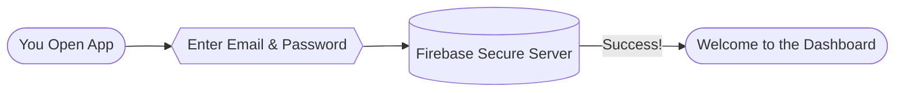
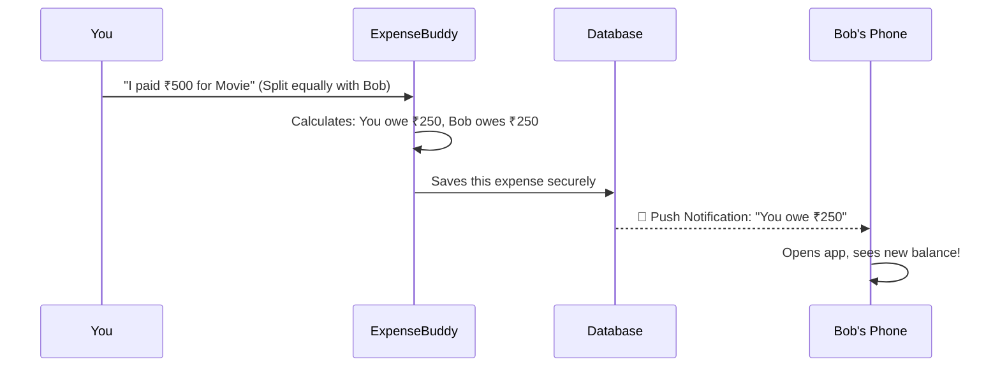
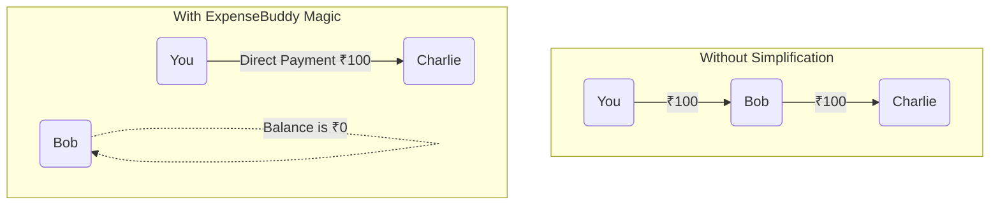
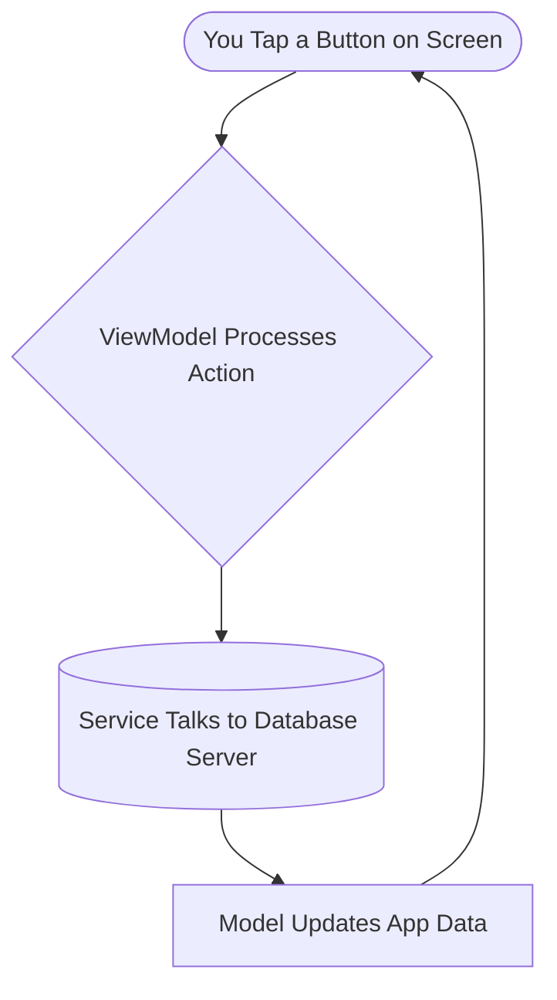

# 🚀 The Complete Guide to ExpenseBuddy

Welcome to **ExpenseBuddy**! This guide will explain everything about the app in a very simple, easy-to-understand way. No complex developer jargon—just simple explanations of what the app does, how it works, and why it's built this way.

---

## 1. What is ExpenseBuddy?

Imagine you go on a weekend trip with three friends:
- You pay **₹1,000** for dinner.
- Bob pays **₹2,000** for the hotel.
- Charlie pays **₹500** for the taxi.

At the end of the trip, who owes who? Doing the math is a headache! **ExpenseBuddy** solves this problem. You just enter who paid what, and the app instantly tells you exactly who owes money and to whom. It's like having an accountant in your pocket.

---

## 2. How the App Works (Step-by-Step)

Here is the flow of the entire application from the moment you open it:

### Step 1: Sign Up & Login
Before you can track money, the app needs to know who you are. The app uses **Google Firebase** to securely save your email, password, and profile picture.

### Step 2: Adding Friends
To split expenses, you need friends on the app. You search for a friend using their email address. If they use ExpenseBuddy, they get added to your list instantly!

### Step 3: Creating Groups
If you are planning a trip or sharing an apartment, you can create a **Group** (like "Goa Trip" or "Apartment 4B"). You can add multiple friends to this group so all expenses related to that topic stay in one place.

### Step 4: Adding an Expense (The Core Feature)
This is where the magic happens. Let's say you bought movie tickets for ₹500 for you and Bob.

---

## 3. The Magic Calculator (Splitting Bills)

When you add an expense, ExpenseBuddy lets you split it in 4 different ways depending on the situation:

1. **Equal Split:** The simplest one! A ₹600 pizza between 3 people = ₹200 each.
2. **Unequal Split:** If someone ate more, you can type EXACTLY what they owe (e.g., You pay ₹400, Bob pays ₹200).
3. **Percentage Split:** Great for tips or taxes (e.g., You pay 60%, Bob pays 40%).
4. **Exact Amount:** You just manually enter exactly what portion belongs to who.

---

## 4. The "Simplification" Magic (How Balances Work)

Sometimes, owing money gets complicated. 
- You owe Bob ₹100.
- Bob owes Charlie ₹100.

Without simplification, you would send Bob ₹100, and Bob would separately send Charlie ₹100. That's two transactions!
With **ExpenseBuddy Simplification**, the app realizes Bob's balance is overall zero, so it just tells **You to pay Charlie ₹100 directly**.

*This feature ensures your group makes the minimum number of payments possible!*

---

## 5. Settling Up (Getting Paid Back)

When it's time to pay your debts, ExpenseBuddy makes it simple:

1. You tap the **"Settle Up"** button on a friend's profile.
2. The app shows you exactly how much you owe them.
3. You can record a cash payment, 
4. Once paid, the app resets your balance to ₹0!

---

## 6. How It All Connects (For Developers)

If you are looking at the code, here is where everything lives inside the app's folders:

- **📁 Models:** The blueprints. This contains the `User` (who you are), `Expense` (what you bought), and `Settlement` (payments).
- **📁 Views:** The screens you see on your phone. Everything you tap, scroll, and read lives here. Built with SwiftUI.
- **📁 ViewModels:** The middle-men. They take your taps from the Views and send them to the Services.
- **📁 Services:** The engines. `AuthService` talks to the login server. `DataService` talks to the database to save and fetch expenses.
- **📁 Utilities:** The calculators. `ExpenseCalculator` contains the math formulas to split bills and simplify debts.

---

*That's it! ExpenseBuddy is designed to take the awkwardness and math out of sharing money. You just enter the numbers, and the app handles the rest beautifully.*
