# 🚀 The Complete Guide to ExpenseBuddy

Welcome to **ExpenseBuddy** — a beautiful iOS app that makes splitting expenses with friends easy and stress-free. Think of it like **Splitwise**, built with **SwiftUI** and powered by **Firebase**.

---

## 1. What Does ExpenseBuddy Do?

Imagine you go on a trip with 3 friends. One person pays for the hotel, another for food, another for the taxi. At the end, nobody knows who owes what. **ExpenseBuddy solves this.** You just tell the app who paid what, and it figures out the rest.

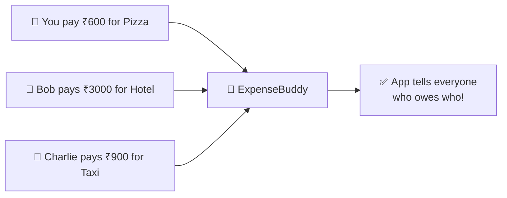

---

## 2. App Screens & Navigation

The app has **4 main tabs** at the bottom, plus a **floating ➕ button** in the center to add expenses.

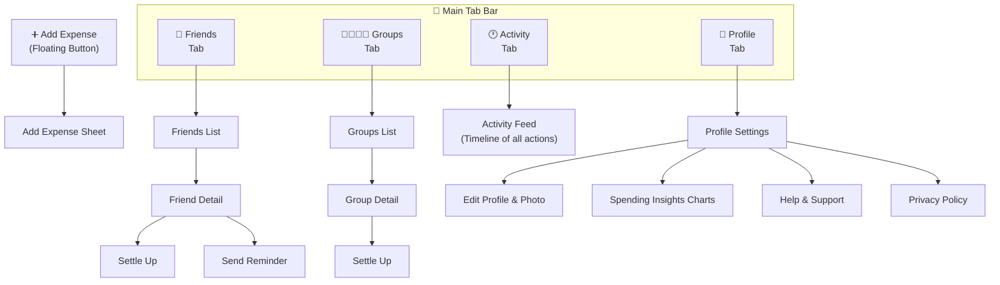

---

## 3. Authentication (Login / Signup)

Before you can use the app, you need to create an account. ExpenseBuddy gives you **3 ways** to get in:

| Method | How It Works |
|--------|-------------|
| **Email + Password** | Type your email and password to sign up or login |
| **Google Sign-In** | One-tap login with your Google account |
| **Forgot Password** | Get a password reset email sent to your inbox |

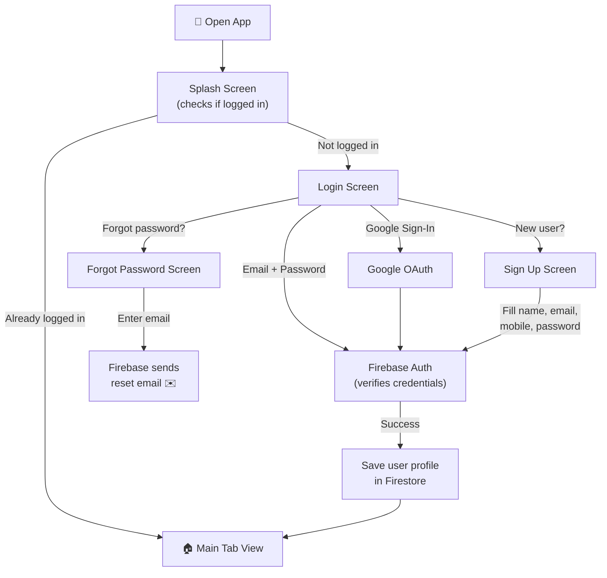

### Sign Up Validations
The app checks everything before creating your account:
- ✅ Name must be at least 2 characters
- ✅ Email must be valid (e.g. `name@email.com`)
- ✅ Password must meet strength rules (min 6 characters)
- ✅ Passwords must match
- ✅ Must accept Terms & Conditions

---

## 4. Friends

Friends are the people you share expenses with. You can **add**, **search**, and **remove** friends.

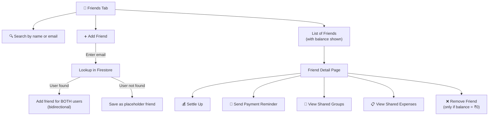

### Key Rules
- **Bidirectional:** When you add a friend who is on ExpenseBuddy, they automatically see you in their friends list too.
- **Cannot remove** a friend if you still owe them money (or they owe you).
- **Reminder:** You can nudge a friend who owes you money — they'll get a push notification.

---

## 5. Groups

Groups let you organize expenses by occasion. For example: "Goa Trip", "Apartment Rent", or "Office Lunch".

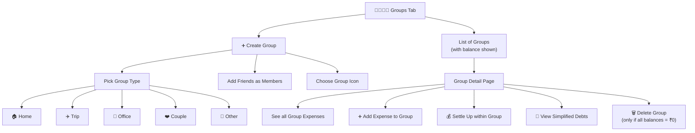

### Key Rules
- A group **cannot be deleted** unless everyone in the group is fully settled (no one owes anyone).
- Each group has its own **icon** and **type** (Home, Trip, Office, Couple, Other).
- The group balance shows how much YOU owe or are owed inside that specific group.

---

## 6. Adding an Expense (The Core Feature)

This is the heart of the app. When someone pays for something, you record it here.

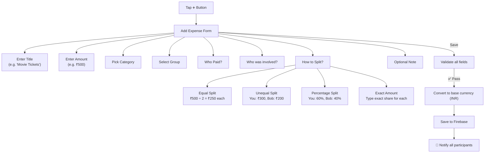

### 10 Expense Categories

| Category | Icon | Category | Icon |
|----------|------|----------|------|
| 🍔 Food & Drink | fork.knife | 🚗 Transport | car |
| 🛍️ Shopping | bag | 🎮 Entertainment | gamecontroller |
| ⚡ Utilities | bolt | 🏠 Rent | house |
| ✈️ Travel | airplane | ❤️ Health | heart |
| 📚 Education | book | ⋯ Other | ellipsis |

### 4 Split Types Explained

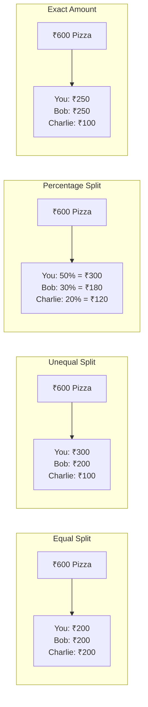

### Rounding Precision
The **Equal Split** uses smart rounding. If ₹100 is split among 3 people:
- Person 1: ₹33.33
- Person 2: ₹33.33
- Person 3: ₹33.34 ← absorbs the remainder

This ensures the total always adds up exactly.

---

## 7. Settle Up (Paying Back)

When someone owes money and pays it back, you record a **settlement**.

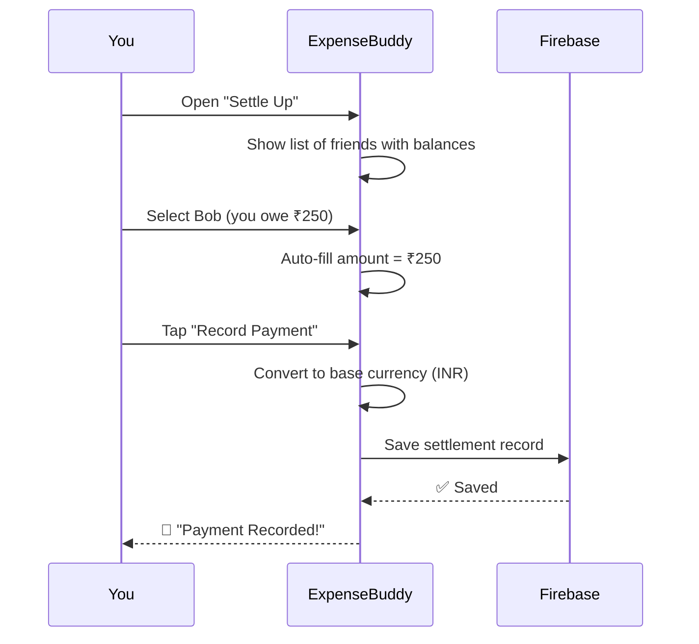

### Smart Settlement Distribution
If Bob and you are in **multiple groups**, and you settle globally (not inside a specific group), ExpenseBuddy **automatically distributes** the payment across all your shared groups — paying off group-by-group until the full amount is covered.

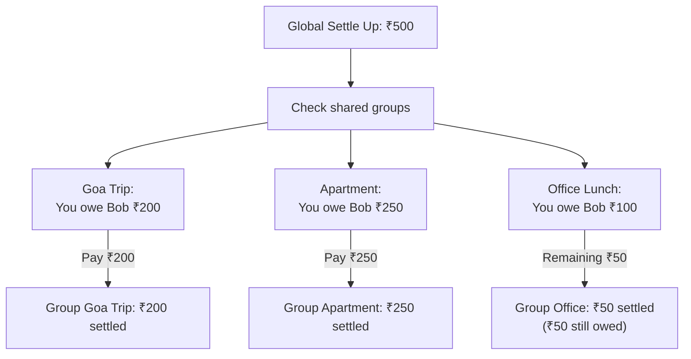

---

## 8. Debt Simplification (The Smart Math)

When money flows between many people, ExpenseBuddy **simplifies the debts** to the **minimum number of payments**.

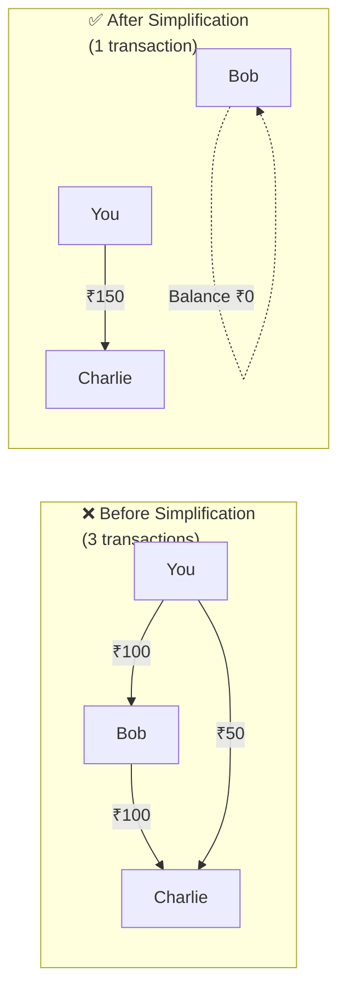

### How It Works (Greedy Algorithm)
1. Calculate the **net balance** for each person (positive = owed money, negative = owes money)
2. Match the **largest debtor** with the **largest creditor**
3. Transfer the minimum of what one owes and the other is owed
4. Repeat until all balances are zero

---

## 9. Activity Feed

The **Activity tab** shows a real-time timeline of everything that happens:

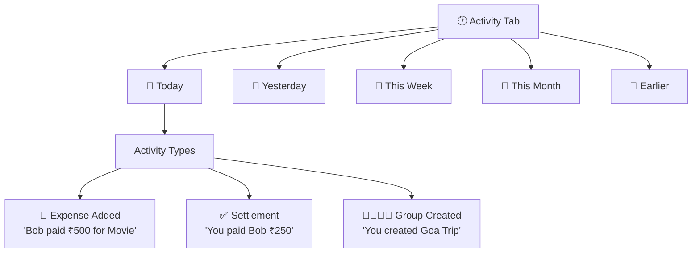

The feed rebuilds automatically (with debouncing) whenever expenses, settlements, or group data changes.

---

## 10. Notifications

ExpenseBuddy has a **3-layer notification system**:

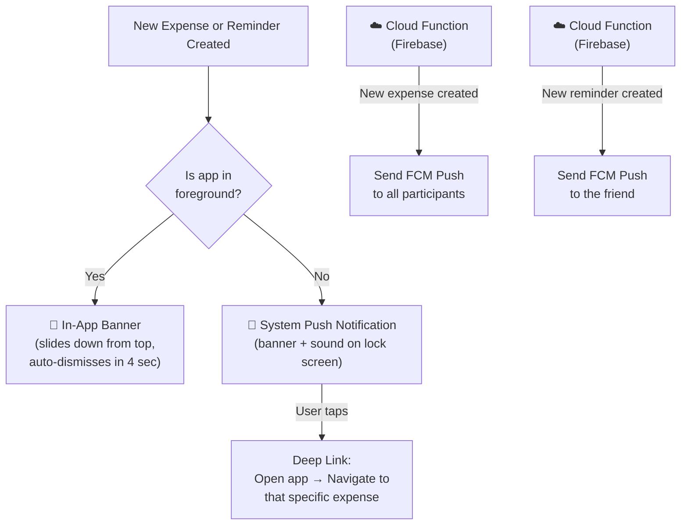

### Notification Types
| Type | When It Triggers |
|------|-----------------|
| 💰 New Expense | Someone in your group adds an expense |
| ⏰ Reminder | A friend reminds you to pay up |

---

## 11. Profile & Settings

The Profile tab is your personal dashboard with settings and account management.

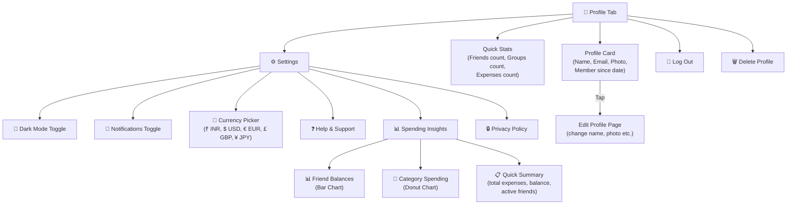

### Profile Deletion Rules
You **cannot delete** your profile if you have any outstanding balances. You must settle up with everyone first. When deleted:
1. ❌ User document removed from Firestore
2. ❌ Friends subcollection removed
3. ❌ Reminders subcollection removed
4. ❌ Firebase Auth account deleted
5. ❌ Google Sign-In session cleared

If the auth deletion fails (e.g. you need to re-login), the app **rolls back** and restores your Firestore data.

---

## 12. Multi-Currency Support

ExpenseBuddy stores all amounts in **INR (₹)** as the base currency. When you switch your display currency, amounts are converted for display and input — but always stored in INR.

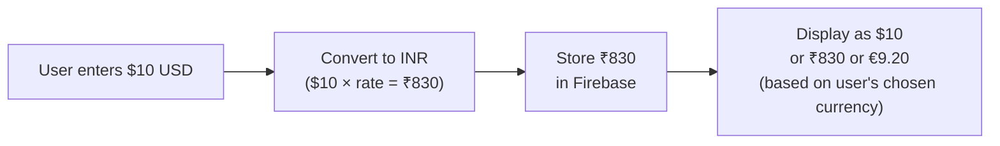

---

## 13. How the Code is Organized (Architecture)

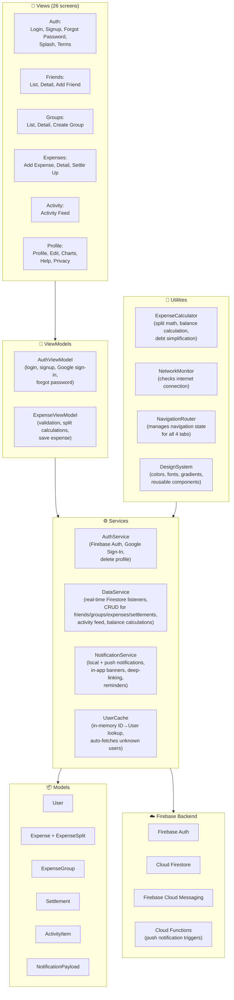

---

## 14. Real-Time Data Sync

ExpenseBuddy uses **6 Firestore Snapshot Listeners** that keep your app data always up-to-date:

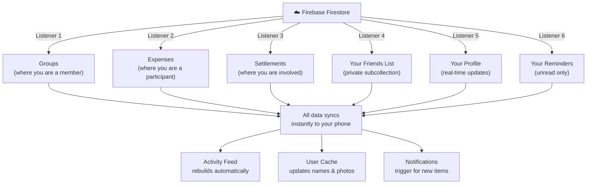

---

## 15. Firestore Database Structure

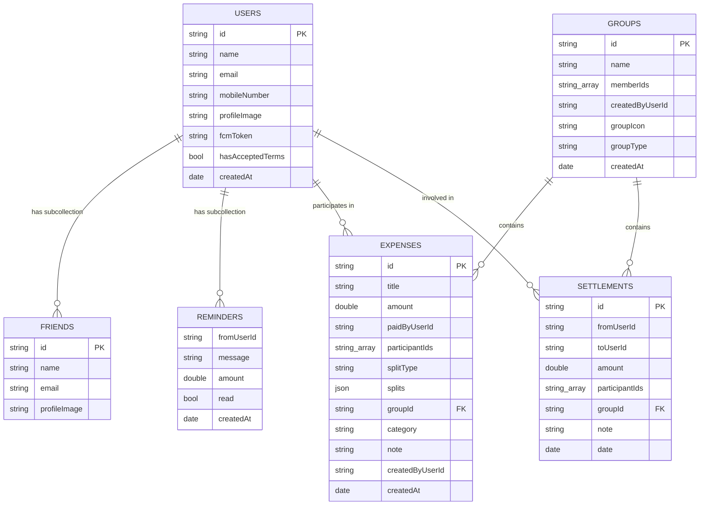

---

## 16. Cloud Functions (Server-Side)

Two Firebase Cloud Functions run automatically when data is created:

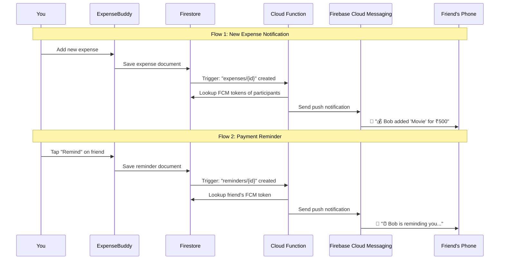

---

## 17. Design System

The app uses a custom design system with:

- **Dark/Light Mode** — toggleable from Profile settings
- **Custom Color Palette** — primary gradients, card backgrounds, green (owed), red (owe), settled gray
- **Rounded Typography** — using the `.rounded` system font design
- **Glassmorphism Effects** — used in charts and cards
- **Haptic Feedback** — light taps on tab switches, heavy impact on "Add Expense"
- **Custom Dock Tab Bar** — a floating capsule-shaped tab bar that hides on sub-pages
- **Smooth Animations** — spring animations on transitions, tab switching, and banner slides

---

## 18. Key Feature Summary

| Feature | Description |
|---------|-------------|
| 🔐 **Email/Password Auth** | Sign up and login with email and password |
| 🔑 **Google Sign-In** | One-tap Google OAuth login |
| 🔄 **Forgot Password** | Email-based password reset |
| 👥 **Friends** | Add, search, remove friends (bidirectional) |
| 🔔 **Reminders** | Nudge friends who owe you money |
| 👨‍👩‍👧‍👦 **Groups** | Organize expenses by occasion (5 types) |
| 💰 **Add Expense** | Record who paid and split 4 ways |
| 📂 **10 Categories** | Food, Transport, Shopping, Entertainment, etc. |
| 🤝 **Settle Up** | Record payments with auto-distribution |
| 🧮 **Debt Simplification** | Minimize number of transactions |
| 📊 **Charts** | Bar chart (balances) + Donut chart (categories) |
| 🌙 **Dark Mode** | System-wide dark/light theme toggle |
| 💱 **Multi-Currency** | Display in INR, USD, EUR, GBP, or JPY |
| 📲 **Push Notifications** | Real-time alerts via FCM + Cloud Functions |
| 🔔 **In-App Banners** | Floating notification banners when app is open |
| 🗑️ **Delete Profile** | Full account deletion with safety checks |
| ⚡ **Real-Time Sync** | 6 Firestore listeners keep everything up-to-date |
| 🌐 **Offline Aware** | Network Monitor tracks connectivity |
| 📱 **Premium UI** | Custom tab bar, haptics, glassmorphism, animations |

---

*ExpenseBuddy — take the awkwardness and math out of sharing money. You enter the numbers, the app handles the rest.* ❤️
