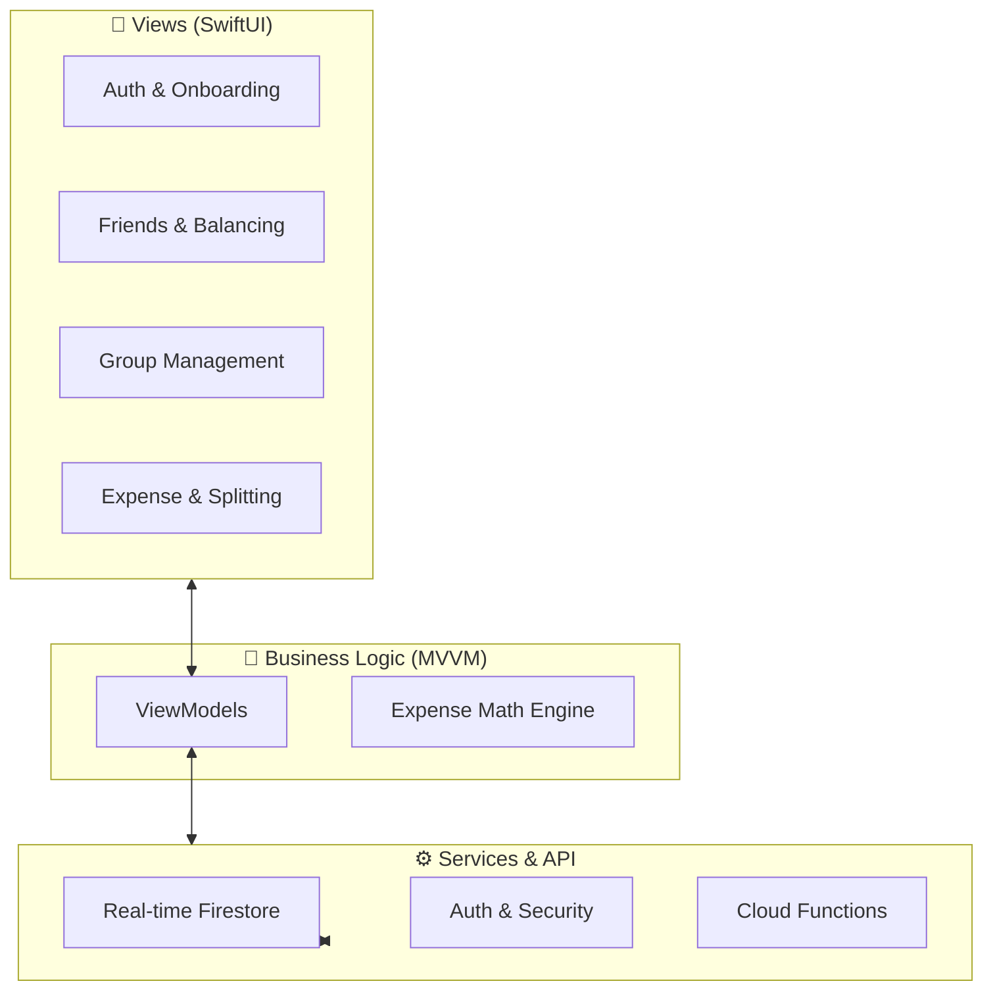
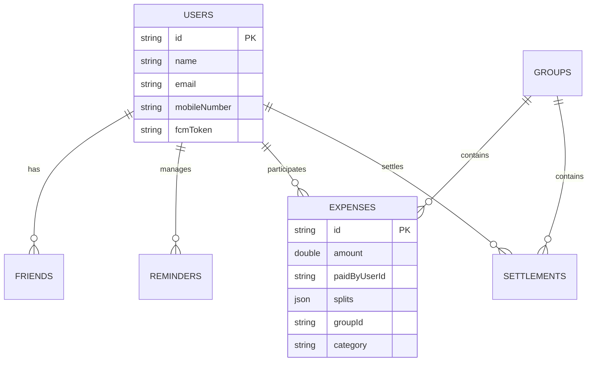

# 🚀 ExpenseBuddy: Smart Expense Tracking Made Easy


**ExpenseBuddy** is a premium iOS application designed to take the awkwardness and complex math out of sharing expenses with friends. Built with **SwiftUI** and powered by **Firebase**, it provides a seamless, real-time experience for splitting bills, managing groups, and settling debts.

---

## ✨ Key Features

| Feature | Description |
| :--- | :--- |
| 💰 **Advanced Splitting** | Split expenses equally, by percentage, by exact amount, or unequally. |
| 👨‍👩‍👧‍👦 **Group Management** | Organize expenses by Trip, Home, Office, or Couple with custom icons. |
| 🧮 **Debt Simplification** | Uses a greedy algorithm to minimize the number of transactions between users. |
| 🔔 **Real-Time Sync** | 6+ Firestore listeners ensure data is always up-to-date across all devices. |
| 📲 **Hybrid Notifications** | In-app floating banners and System Push notifications via Firebase Cloud Functions. |
| 💱 **Multi-Currency** | Support for INR, USD, EUR, GBP, and JPY with automatic conversion. |
| 📊 **Spending Insights** | Visual donut and bar charts for category-wise and friend-wise spending. |
| 🌙 **Premium UI** | Glassmorphic design, haptic feedback, and a custom dock-style tab bar. |

---

## 🛠️ Tech Stack & Architecture

ExpenseBuddy is built with a focus on scalability and clean code, following the **MVVM (Model-View-ViewModel)** architectural pattern.

- **Frontend**: SwiftUI, Combine
- **Backend**: Firebase Auth, Cloud Firestore, Cloud Functions, FCM
- **Authentication**: Email/Password, Google Sign-In
- **Design**: Custom Design System with Dark/Light mode support
- **State Management**: ObservableObject with real-time Firestore synchronization

### High-Level Architecture


---

## 🧮 Smart Debt Simplification

One of the standout features of ExpenseBuddy is its ability to simplify complex webs of debt. Instead of multiple back-and-forth payments, the app calculates the net balance and suggests the minimum number of transactions required to settle everyone.

**Example:**
- Alice owes Bob $10
- Bob owes Charlie $10
- **Simplified:** Alice pays Charlie $10. Bob is settled.

---

## 📡 Database Schema



---

## 🚀 Getting Started

### Prerequisites
- macOS with **Xcode 15.0+**
- A **Firebase Project** for authentication and data storage

### Setup Instructions
1. **Clone the repository:**
   ```bash
   git clone https://github.com/surajitr/ExpenseBuddy.git
   cd ExpenseBuddy
   ```
2. **Add Firebase:**
   - Download `GoogleService-Info.plist` from your Firebase Console.
   - Place it in the `ExpenseBuddy/` directory.
3. **Open in Xcode:**
   ```bash
   open ExpenseBuddy.xcodeproj
   ```
4. **Build and Run:**
   - Select your preferred simulator (e.g., iPhone 15 Pro) and press `Cmd + R`.

---

## 👤 Author
**Surajit Roy**  
iOS Developer | Swift & SwiftUI Specialist

---

*Take the math out of your social life with ExpenseBuddy.* ❤️
